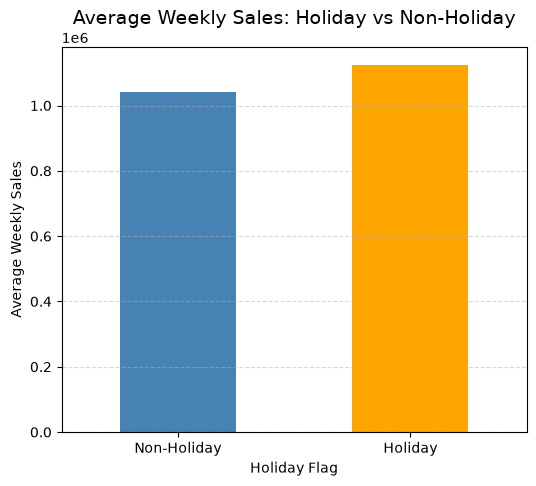
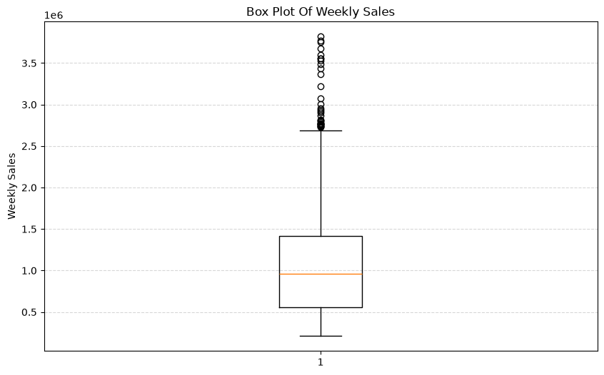
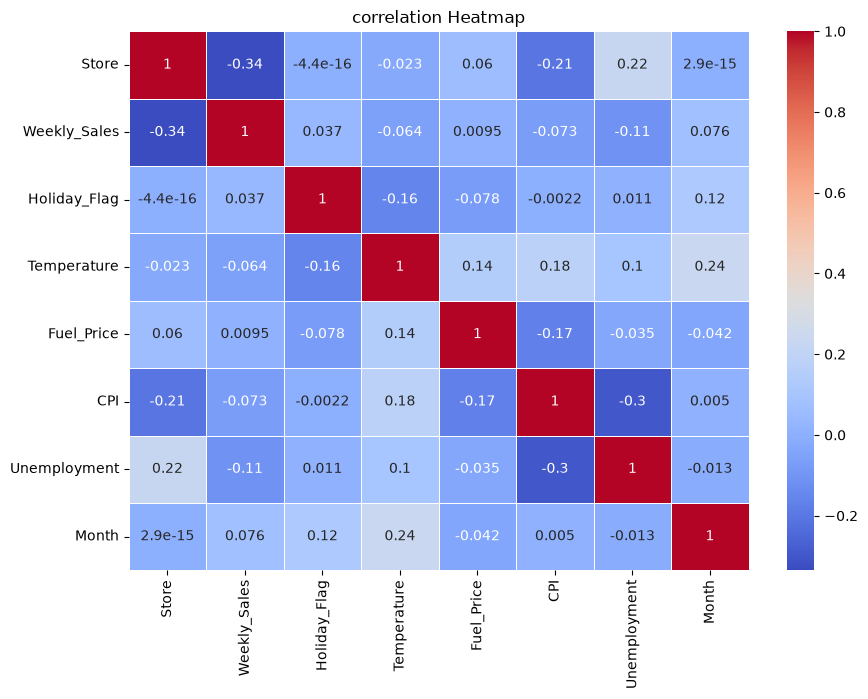
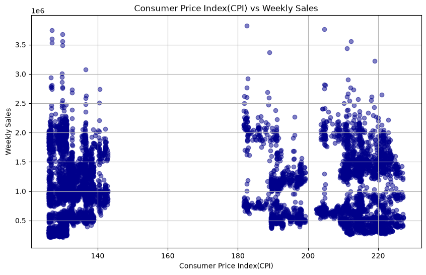
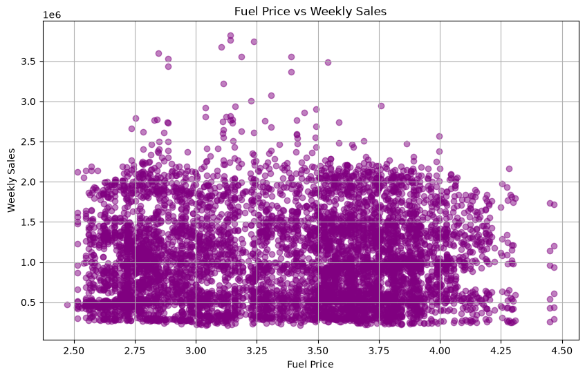
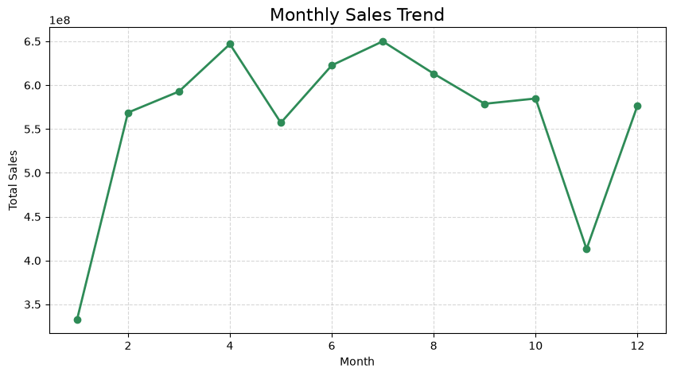
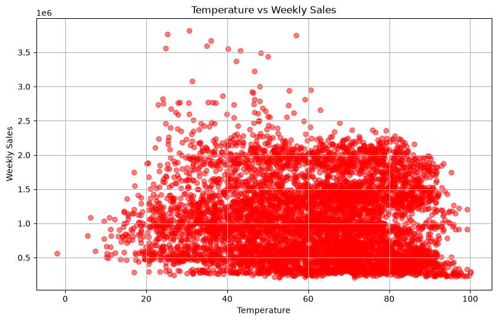
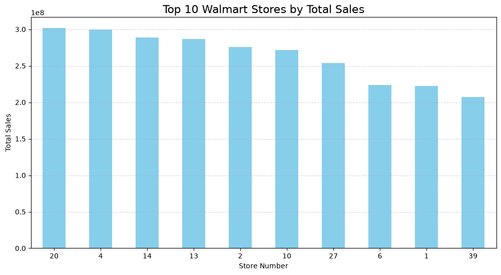
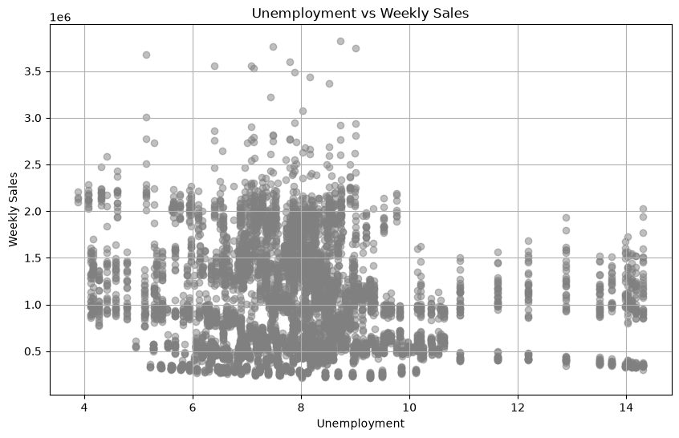
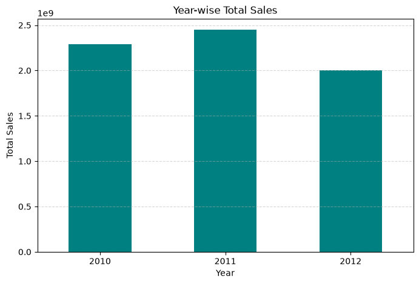

# 🛒 Walmart Sales Analysis

## 📌 Project Overview

This project analyzes Walmart weekly sales data using Python and performs Exploratory Data Analysis (EDA) to discover sales trends, business patterns, and valuable insights.

The project demonstrates data cleaning, visualization, and business analysis using real-world retail sales data.

---

## 🎯 Objectives

- Analyze Walmart weekly sales
- Identify top-performing stores
- Compare Holiday vs Non-Holiday sales
- Analyze Monthly and Yearly sales trends
- Study the impact of Fuel Price, Temperature, CPI, and Unemployment
- Detect outliers
- Generate business insights

---

## 🛠️ Tools & Technologies

- Python
- Pandas
- NumPy
- Matplotlib
- Jupyter Notebook
- VS Code

---

## 📂 Dataset

- Walmart Sales Dataset
- Records: **6435**
- Features:
  - Store
  - Date
  - Weekly_Sales
  - Holiday_Flag
  - Temperature
  - Fuel_Price
  - CPI
  - Unemployment

---

## 📊 Analysis Performed

- Data Cleaning
- Feature Engineering
- Top 10 Stores Analysis
- Holiday vs Non-Holiday Sales
- Monthly Sales Trend
- Yearly Sales Trend
- Fuel Price Analysis
- Temperature Analysis
- CPI Analysis
- Unemployment Analysis
- Correlation Heatmap
- Sales Distribution
- Box Plot
- Most Consistent Stores
- Most Fluctuating Stores
- Holiday Sales Analysis
- Business Insights

---

## 💡 Key Findings

- Holiday weeks generally generate higher sales.
- Store 20 is one of the highest-performing stores.
- Store 37 has the most consistent sales.
- Store 14 shows the highest sales fluctuation.
- Fuel Price, CPI, Temperature, and Unemployment have only a weak relationship with Weekly Sales.

---

## 🚀 Future Improvements

- Build an interactive Power BI Dashboard
- Develop a Sales Forecasting Model
- Deploy the project using Streamlit

---

## 👩‍💻 Author

**Parinati Diwan**

Aspiring Data Analyst

## 📷 Project Visualizations

### 📈 Average Sales: Holiday vs Non-Holiday

---

### 📦 Weekly Sales Distribution (Box Plot)

---

### 🔥 Correlation Heatmap

---

### 📊 CPI vs Weekly Sales

---

### ⛽ Fuel Price vs Weekly Sales

---

### 📅 Monthly Sales Trend

---

### 🌡️ Temperature vs Weekly Sales

---

### 🏆 Top 10 Walmart Stores by Total Sales

---

### 👥 Unemployment vs Weekly Sales

---

### 📆 Year-wise Total Sales

